# **Resonix**

Resonix is your personal, ad-free music player that gives you complete control over your collection.
Add your favorite tracks, organize them your way, and enjoy a seamless listening
experience—completely yours, with no interruptions.

---

## **Table of Contents**

- [**Resonix**](#resonix)
    * [**Resonix-app**](#resonix-app)
    * [🛠 **Tech Stack**](#-tech-stack)
    * [🚀 **Features (Planned & Implemented)**](#-features-planned--implemented)
    * [📸 **Screenshots / Preview**](#-screenshots--preview)
    * [📲 **How to Use**](#-how-to-use)
    * [📌 **Notes**](#-notes)

---

## **Resonix-app**

This repository contains the **Resonix mobile app**, built with **Dart** and powered by a smooth,
intuitive UI. The goal is to provide a lightweight and customizable music experience without ads or
restrictions. ⚠️ Please note this is my first app project, so there may be bugs, issues, or unoptimized code.

---

## 🛠 **Tech Stack**

- **Dart & Flutter** – For building a smooth mobile experience.

---

## 🚀 **Features (Planned & Implemented)**

✔️ **Ad-free music playback** – No interruptions, just pure listening.  
✔️ **Add & manage your own music** – No streaming limits; your library, your way.  
✔️ **Smart recommendation** – Discover new tracks based on your listening habits.  
✔️ **Offline support** – Play your songs even without an internet connection (server in one network).  
✔️ **Lightweight & efficient** – Designed to be fast and responsive.  
✔️ **Playlist support** – Organize your tracks into playlists.  
✔️ **Following/Followers** – Follow your friends or your favorite artists.  
🛠 **(Planned) Equalizer & audio enhancements** – Customize your sound experience.
🛠 **(Planned) Cloud Uploads** – Allow users to upload their music to a personal cloud server.

---

## 📸 **Screenshots / Preview**

Here’s a preview of **Resonix in action**:

| **General UI**                         | **Playback & Queue**                               | **Library & Playlists**                        |
|----------------------------------------|----------------------------------------------------|------------------------------------------------|
| 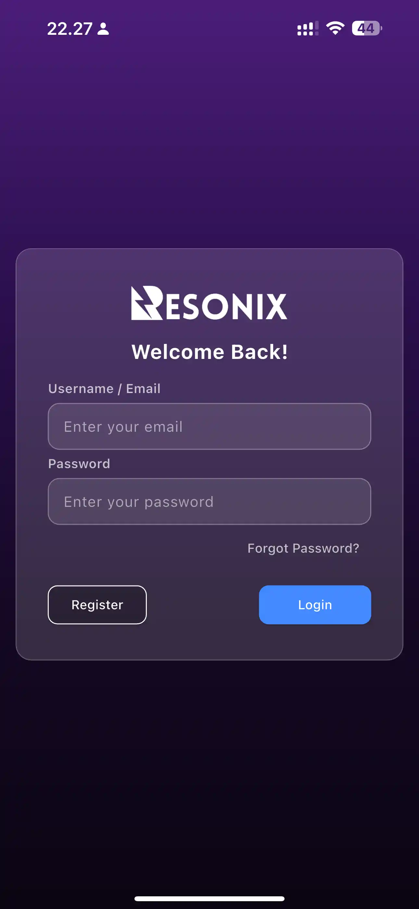       | 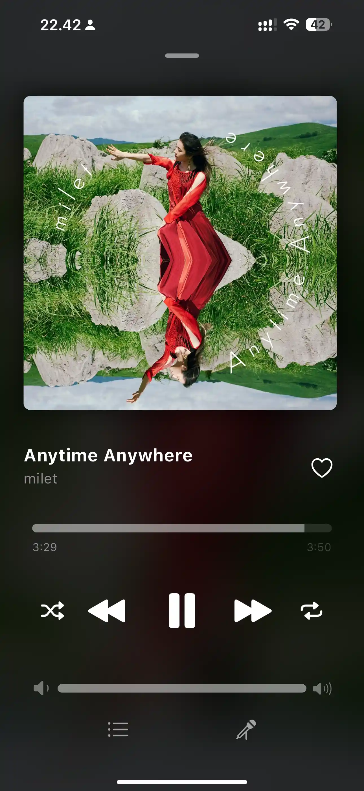               | 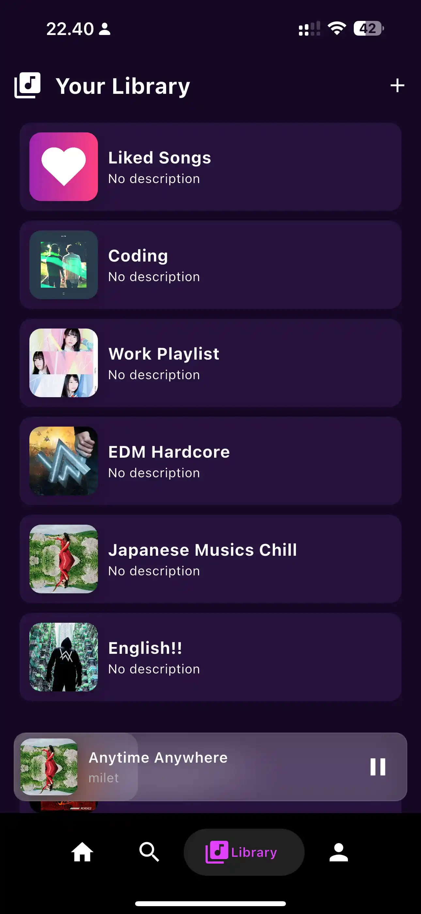           |
| 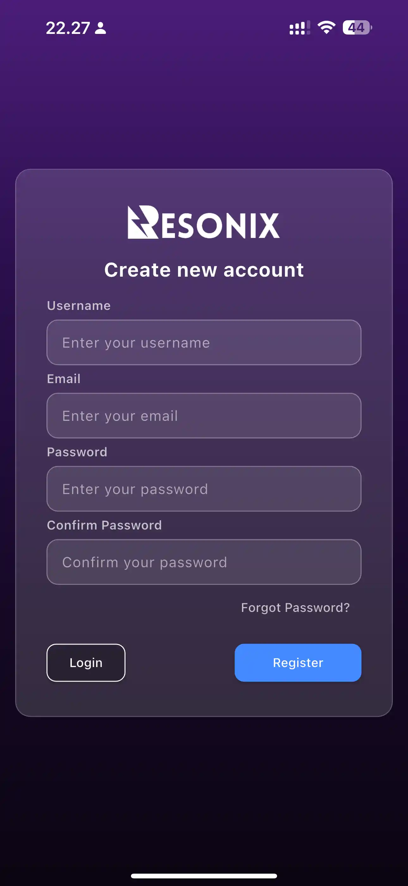 | 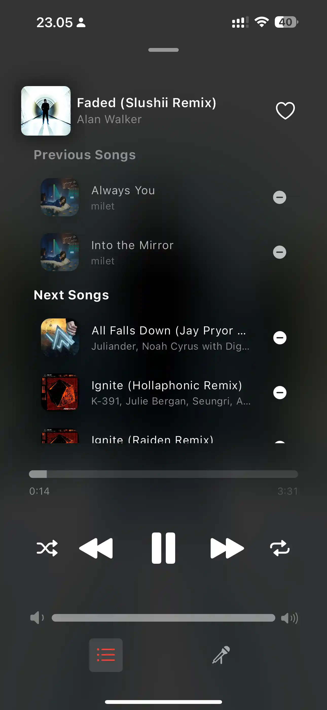   | 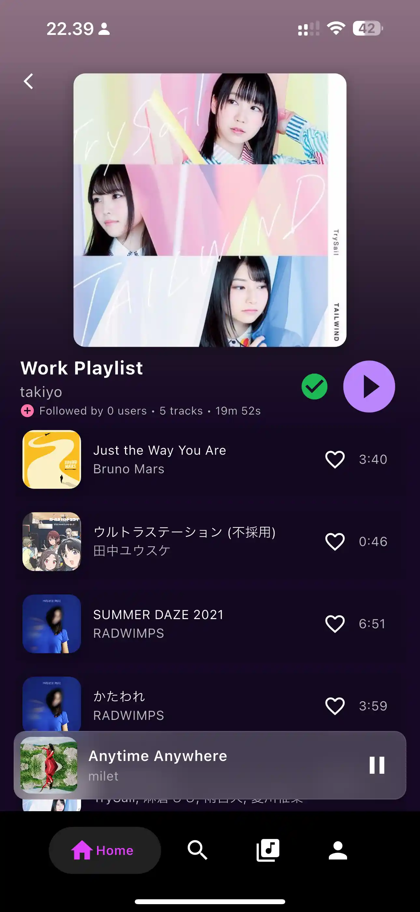         |
| 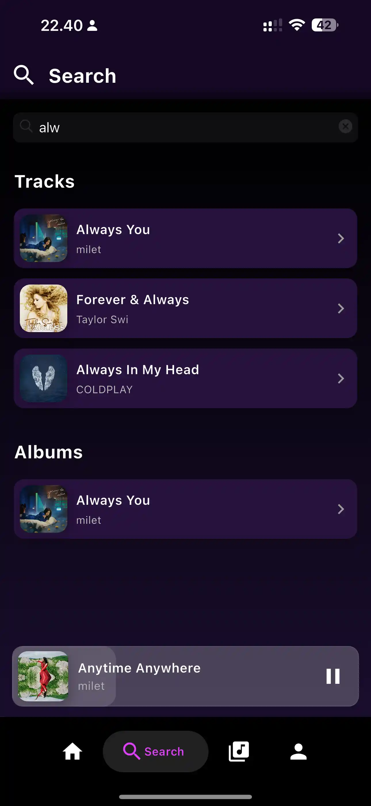     | 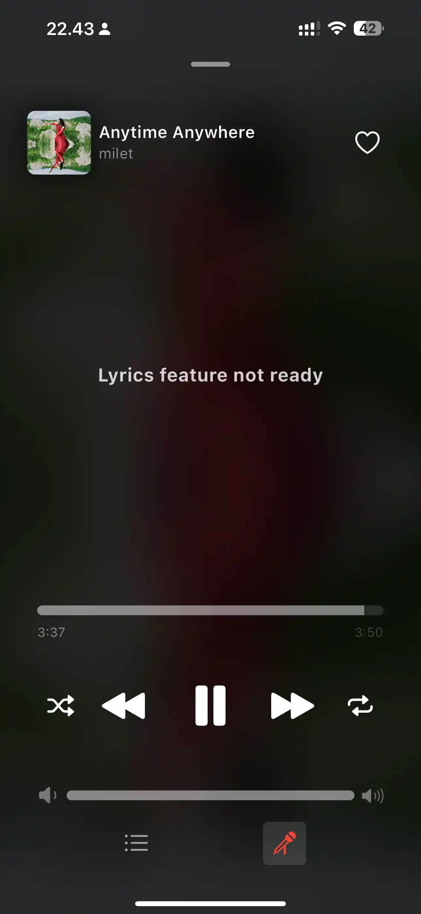 | 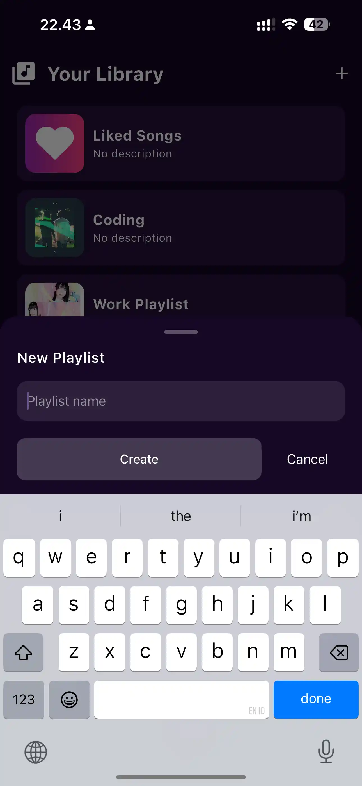 |

| **Artists & Albums**                             | **Tracks & Track Modals**                                      | **User Profiles**                                  |
|--------------------------------------------------|----------------------------------------------------------------|----------------------------------------------------|
| 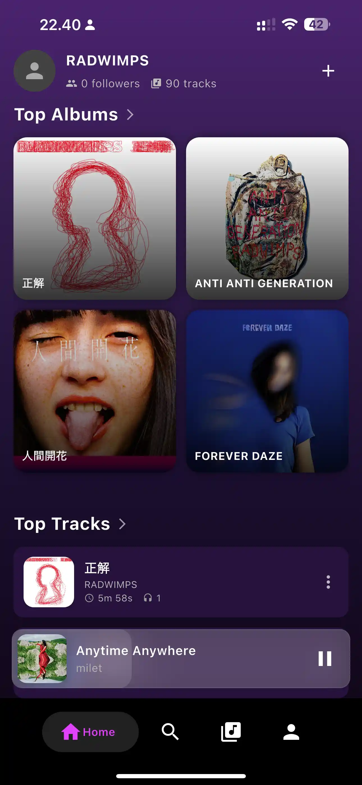               | 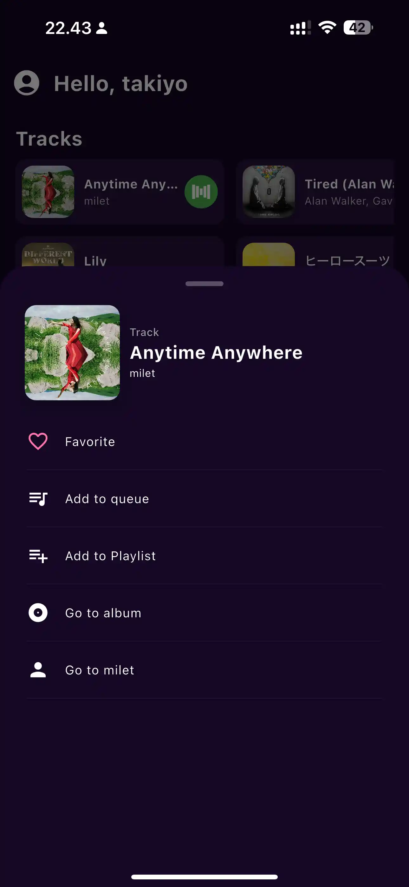                   | 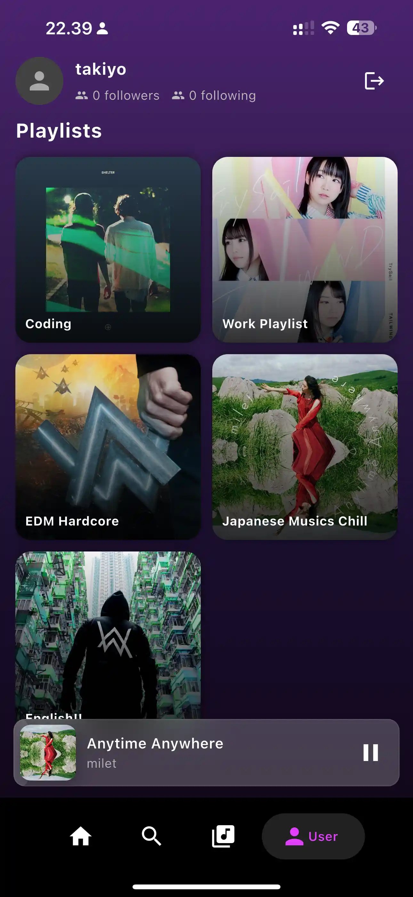                     |
|  | 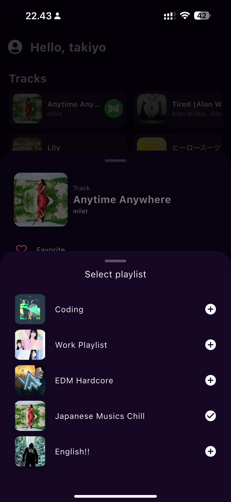 | 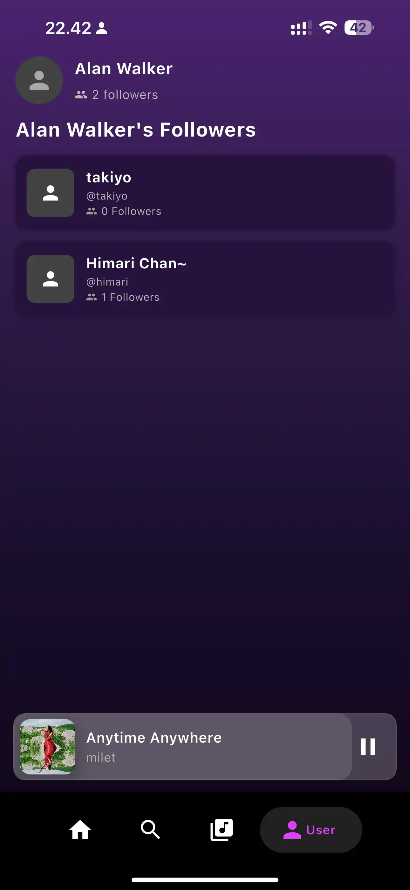 |
| 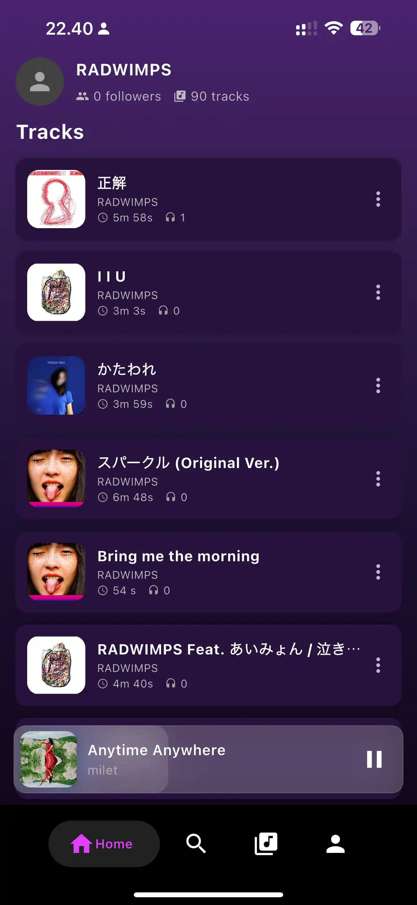 |                                                                | 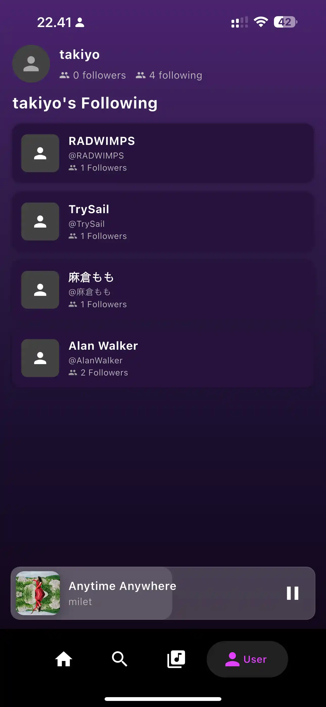 |

| **Background Playback**                                        |                                                       |
|----------------------------------------------------------------|-------------------------------------------------------|
| 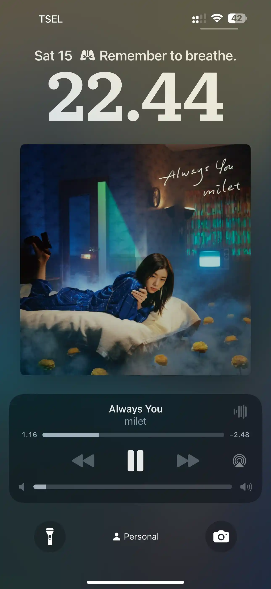                  | 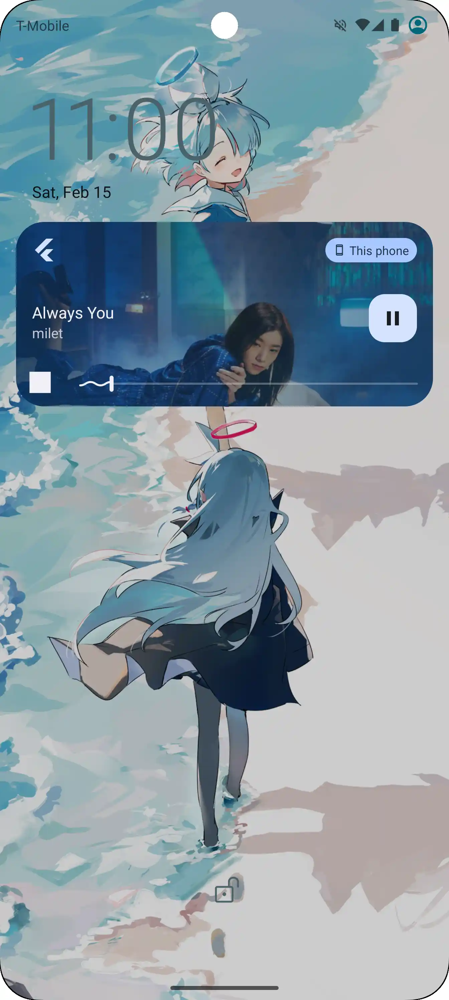 |
| 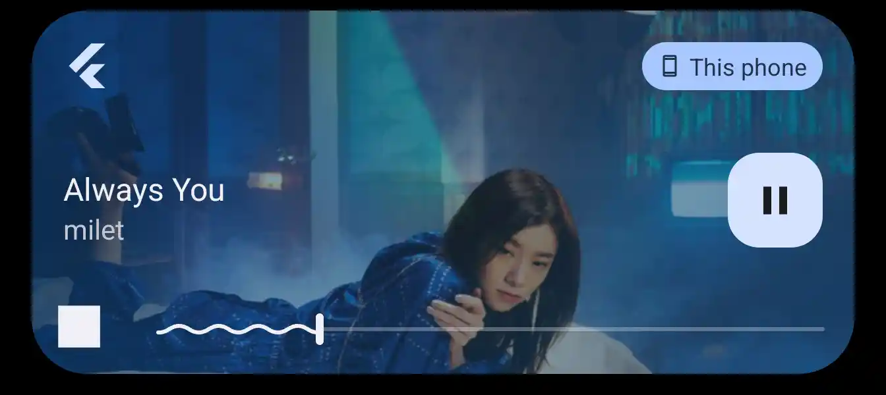 | 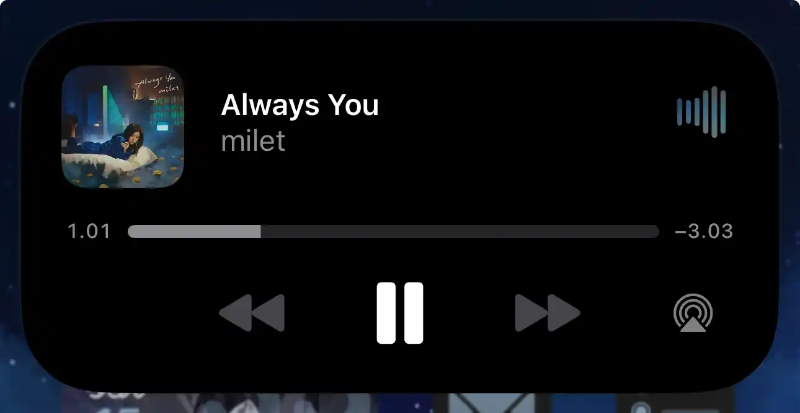    |

---

## 📲 **How to Use**

Want to try Resonix? Here’s how you can set it up:

1️⃣ **Clone this repository:**

   ```sh
   git clone https://github.com/yourusername/resonix-app.git
   cd resonix-app
   ```  

2️⃣ **Install dependencies:**

   ```sh
   flutter pub get
   ```  

3️⃣ **Run the app on your emulator or device:**

   ```sh
   flutter run
   ```  

---

## 📌 **Notes**

🔹 This is a **mid-project**, so development is ongoing! I may continue working on it when I have
free time.  
🔹 Contributions & feedback are always welcome—feel free to fork the repo and submit PRs.  
🔹 Future improvements may include **playlist support, better UI, and many more**.

```
