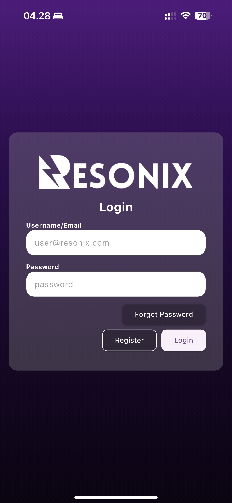
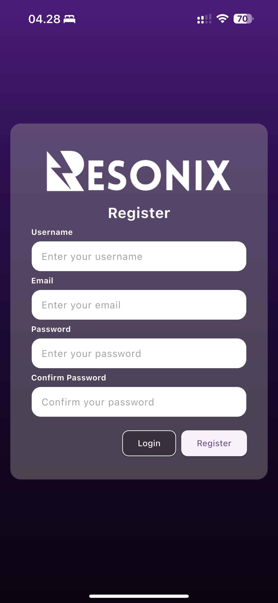
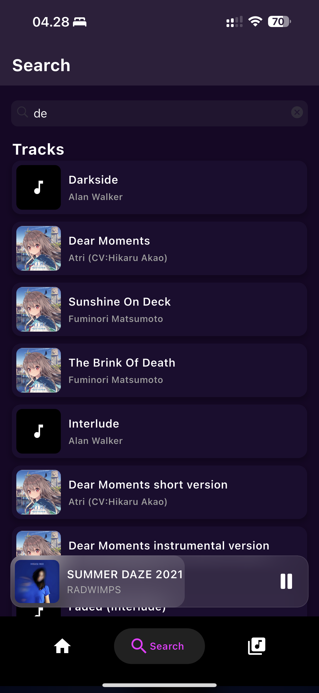
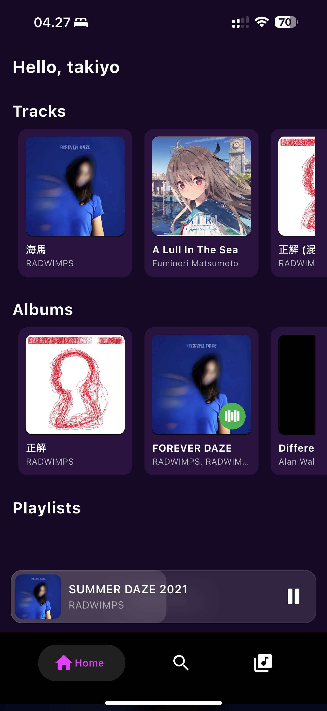
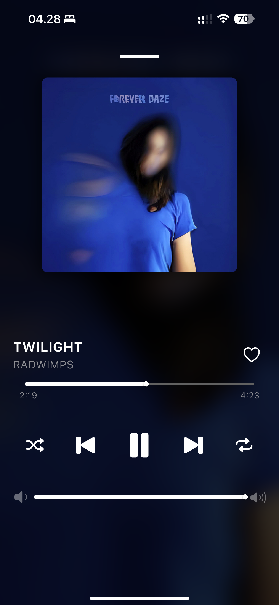
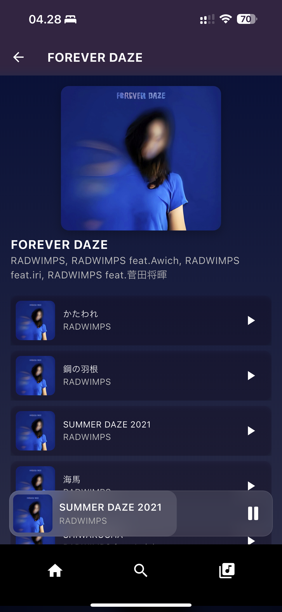
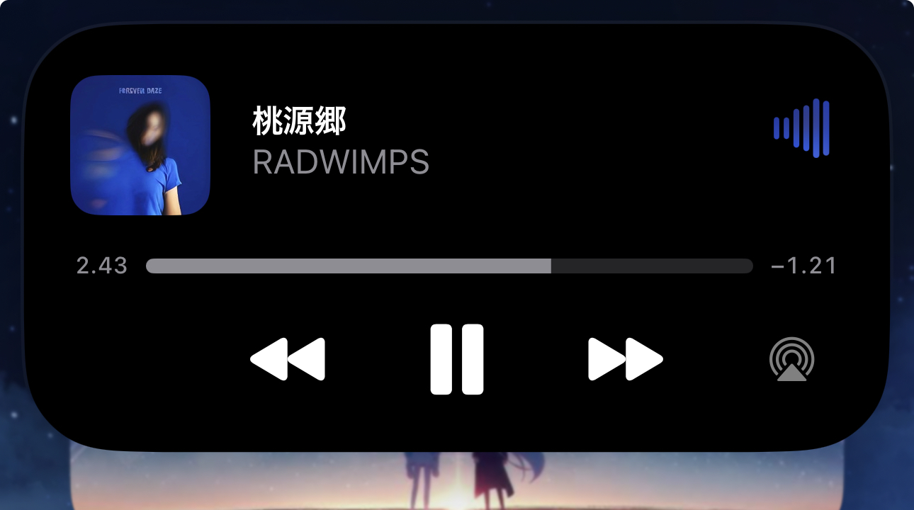
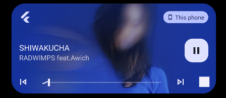
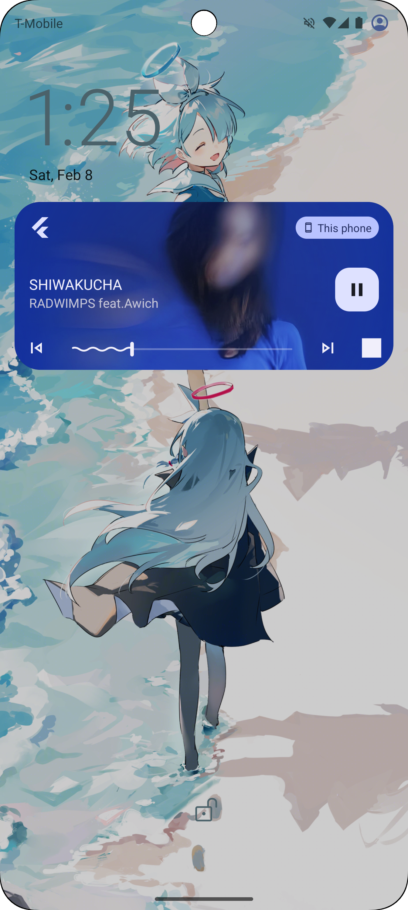

# **Resonix**

Resonix is your personal, ad-free music player that gives you complete control over your collection.
Add your favorite tracks, organize them your way, and enjoy a seamless listening
experience—completely yours, with no interruptions.

## **Resonix-app**

This repository contains the **Resonix mobile app**, built with **Dart** and powered by a smooth,
intuitive UI. The goal is to provide a lightweight and customizable music experience without ads or
restrictions. ⚠️ Please note this is my first app project, so there may be bugs, issues, or unoptimized code.

---

## 📸 **Screenshots / Preview**

Here’s a preview of **Resonix in action**:

| Login                           | Register                              | Search                            |
|---------------------------------|---------------------------------------|-----------------------------------|
|  |  |  |

| Home Screen                          | Now Playing                                 | Album                           |
|--------------------------------------|---------------------------------------------|---------------------------------|
|  |  |  |

These screenshots shows that the music supports background playback and lock screen controls.

| Dynamic Island + notification (background)                                                            | Lock Screen iOS                             | Lock Screen Android                           |
|-------------------------------------------------------------------------------------------------------|---------------------------------------------|-----------------------------------------------|
| <br/> |  |  |

👉 **More screenshots will be added as development progresses!**

---

## 🚀 **Features (Planned & Implemented)**

✔️ **Ad-free music playback** – No interruptions, just pure listening.  
✔️ **Add & manage your own music** – No streaming limits; your library, your way.  
✔️ **Offline support** – Play your songs anytime, even without an internet connection.  
✔️ **Lightweight & efficient** – Designed to be fast and responsive.  
🛠 **(Planned) Playlist support** – Organize your tracks into playlists.  
🛠 **(Planned) Equalizer & audio enhancements** – Customize your sound experience.

---

## 📲 **How to Use**

Want to try Resonix? Here’s how you can set it up:

1️⃣ **Clone this repository:**

   ```sh
   git clone https://github.com/yourusername/resonix-app.git
   cd resonix-app
   ```  

2️⃣ **Install dependencies:**

   ```sh
   flutter pub get
   ```  

3️⃣ **Run the app on your emulator or device:**

   ```sh
   flutter run
   ```  

---

## 🛠 **Tech Stack**

- **Dart & Flutter** – For building a smooth mobile experience.

---

## 📌 **Notes**

🔹 This is a **mid-project**, so development is ongoing! I may continue working on it when I have
free time.  
🔹 Contributions & feedback are always welcome—feel free to fork the repo and submit PRs.  
🔹 Future improvements may include **playlist support, better UI, and many more**.

```
